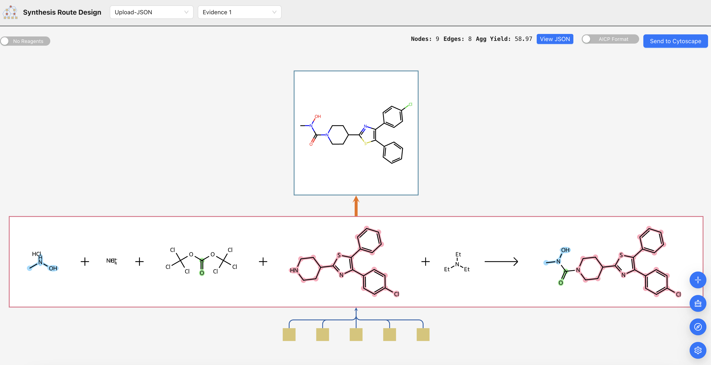

# RouteWise

1.  [Prerequisite](#prerequisite)
2.  [Installation](#installation)
3.  [Features](#features)
4.  [Visualize data using JSON examples](#visualize-data-using-json-examples)
5.  [JSON data structure explained](#json-data-structure-explained)
6.  [Interactive API Documentation and Testing](#interactive-api-documentation-and-testing)
7.  [Support for Predicted Synthesis Routes](#support-for-predicted-synthesis-routes)
8.  [Local Deployment Without Containerization](#Local-Deployment-Without-Containerization)

## Prerequisite

Required software you need to be installed before you move to visualizer installation step:
* Any web-browser

Optional (not required, but nice to have):
* [Git](https://git-scm.com/)


## Installation


1. Clone this Git repository.

   ```bash
   git clone https://github.com/ncats/RouteWise
   ```

   Enter into the subdirectory containing the source code.

   ```bash
   cd RouteWise
   ```

   To ensure you have the latest updates for this repository, you can use the following command:


   ```bash
   git pull
   ```

2. Set the default Docker platform:
   ```bash
   export DOCKER_DEFAULT_PLATFORM=linux/amd64
   ```

3. Build the Docker containers:
   ```bash
   docker compose build --parallel
   ```

4. Start the containers:
   ```bash
   docker compose up -d
   ```

5. Open the front-end application in your browser:
   [http://localhost:4204/](http://localhost:4204/)


   Interactive API documentation via Swagger is available at:
   [http://0.0.0.0:5099/api/v1/docs/aicp/rw_api](http://0.0.0.0:5099/api/v1/docs/aicp/rw_api)


## Features


- **Route Selection Dropdown**: Includes the "SynthGraph" option to view the synthesis graph itself. Evidence routes are labeled as "Evidence 0", "Evidence 1", etc., and predicted routes are labeled as "Predicted 0", "Predicted 1", etc. For massive graphs with cycles (e.g., ASKCOS examples), use the force-directed layout for rendering.


- **AICP/Cytoscape JSON Toggle**: Enables users to view JSON data in different formats, including AICP and Cytoscape formats.
- **Upload JSON Functionality**: Provides options to upload JSON files, Cytoscape JSON files, or pass JSON data directly in the request body using the `json_data` parameter. Users can also refer to the Jupyter notebook example for uploading JSON or use the Swagger documentation available at [http://0.0.0.0:5099/api/v1/docs/aicp/rw_api](http://0.0.0.0:5099/api/v1/docs/aicp/rw_api).
- **Example Graphs**: Includes two evidence-based route examples, an ASKCOS Route Sample and one hybrid example which includes both evidence and predicted routes. The ASKCOS Route Sample is parsed and converted internally into the graph format before rendering.
- **Send To Cytoscape Button**: Allows users to send the current graph to Cytoscape. Ensure Cytoscape is running in the background for this feature to work.
- **Aggregate Yield Display**: Displays aggregate yield as "Agg Yield" on top of the graph for better visualization.
- **User Settings**: Offers various settings that users can toggle to customize their experience, including graph rendering options and visualization preferences.

- **Enable Normalize Roles for Reactions**: This toggle allows users to enable or disable the normalization of reaction roles for RXN SMILES. When enabled, the application processes RXN SMILES to ensure consistent roles for reactants, reagents, and products. By default, this setting is disabled.

      Logic:

         This function reassigns the roles of substances (reactants, reagents, and products) in a reaction SMILES (RXSMILES) string based on atom mapping. It ensures consistency by:
         1. Checking for atom mapping in the RXSMILES.
         2. Parsing the RXSMILES into reactants, reagents, and products.
         3. Reassigning roles:
            - Reactants with no atom mapping overlap with products are reassigned as reagents.
            - Reagents with atom mapping overlap with products are reassigned as reactants.
         4. Reconstructing the RXSMILES with updated roles:
            - Reactants are placed on the left side of the RXSMILES (before the first `>` delimiter).
            - Reagents are placed in the middle section (between the first and second `>` delimiters).
            - Products are placed on the right side (after the second `>` delimiter).
            - During the role normalization process, the fragment indices in the fragment-section of the RXSMILES extension (|f:u.v,w.x|) are automatically updated as necessary to reflect the position of the fragments of substances at the end of the process.


- **Show Structures for Substances**: This toggle allows users to show or hide graphical depictions of substances in the graph. When enabled, all depictions are shown; when disabled, only depictions for terminal molecules are shown.

- **Duplicate Reagents and Starting Materials**: This toggle allows users to duplicate reagents and starting materials in the graph.

- **Highlight Atom Indices in Reaction Depictions**: This toggle enables or disables the highlighting of atom indices in graphical depictions.

- **Show Atom Indices in Reaction Depiction**: This toggle allows users to display atom indices in molecular depictions. When enabled, atom indices are shown for atoms with mapping information, providing additional clarity in visualizing molecular structures.

- **Utilize Structure SVGs from JSON**: This toggle allows users to utilize structure SVGs provided in the JSON data rather than generating new SVGs from the APIs. When enabled, the highlight atom indices and show atom indices options are disabled.

- **Set Edge Style**: Users can choose the style of edges in the graph, including options like "Round Taxi," "Straight," and "Segments."

- **Product Edge Thickness**: Users can adjust the thickness of product edges in the graph using a slider.


### Visualize data using JSON examples

You can use attached JSON examples (check `json-examples` folder) to render some prepared graphs.
To do so, select `Upload JSON`from the drop-down list, then select the file in appropriate JSON format by clicking on `Select JSON file`.

You can also visualize synthesis routes by using the API as follows.

When you open the front-end application, a room ID will be assigned to you. You can find this room ID in the URL after `?room_id=<room_id>`. To send data to the backend, you now have two options depending on the format of your input:

- For raw JSON input (e.g., from a Python dictionary or JSON file), use the `/upload_json_body/` endpoint. This expects a JSON payload in the request body, with the room_id and convert_from_askcos values passed as query parameters.

- For file uploads (e.g., uploading a .json file), use the `/upload_json_file/` endpoint. This expects a multipart/form-data request, with the room_id and convert_from_askcos included as form fields and the file included as an upload.

Both examples are demonstrated in the Jupyter notebook, where you can choose the appropriate method based on your input format. Be sure to paste your assigned room ID in the relevant input field or parameter to ensure the data is routed correctly.

In the following section we'll describe basic graph structure, so you can create and render your own datasets.
<br>
<br>
<br>


## Interactive API Documentation and Testing
<br>

  Interactive API documentation via Swagger is available at:
   [http://0.0.0.0:5099/api/v1/docs/aicp/rw_api](http://0.0.0.0:5099/api/v1/docs/aicp/rw_api)

<br>


## JSON data structure explained

If you open any of the attached to this repo examples in JSON format - you may notice, that graph structure is as simple as the following pattern:

```
{
  "synth_graph": {
    "nodes": [],
    "edges": []
  },
  "routes": [
      {
        "aggregate_yield": 58.,
        "predicted": false,
        "route_index": 1,
        "route_status": "Viable Synthesis Route",
        "method": "AICP",
        "route_node_labels": [...
        ]
      }
    ]
}
```

Where `nodes` is an array of graph nodes, and `edges` - array of graph edges (connectors between the nodes).

<hr>

### Nodes

Mandatory fields/attributes are marked with `*`.

| Attribute | Description |
| --- | --- |
| `node_type`* | Type of the node, either **reaction** or **substance**, represented by circle and square shaped nodes, respectively. |
| `rxid`* | (Reaction nodes only) Primary unique identifier for reaction nodes. |
| `inchikey`* | (Substance nodes only) Primary unique identifier for substance nodes, which is their InChI-Key. |
| `node_label`* | Label for the node. The primary role of this field is to have a universal attribute for nodes that encode their primary unique identifier regardless of node type. |
| `srole`* | Defined for substance nodes only: can be **sm** (starting material), **tm** (target molecule) or **im** (intermediate). Substance nodes colored accordingly. |
| `rxsmiles` | (Reaction nodes only) Primary structural information for reactions in RXSMILES format. |
| `canonical_smiles` | (Substance nodes only) Canonical SMILES string representing the chemical structure. |
| `original_rxsmiles` | (Reaction nodes only) This allows for any post-processing of this attribute and store the results in the `rxsmiles` attribute while preserving the original (unmodified) RXSMILES string. |
| `base64svg` | (Both node types) Base64-encoded SVG image for graphical depiction. Can be used to bypass built-in depiction mechanism from SMILES and RXSMILES. |
| `uuid` | Unique identifier for nodes (across both types), it is the systematically generated UUID which we prefixed with node types to further reduce the possible chance of UUID collision. The use of UUID is somewhat redundant with the node label attribute, but the latter provides a more "human readable" way to trace information flow. |
| `yield_info` | (Reaction nodes only) Contains predicted yield information: `yield_predicted` and `yield_score`. |
| `provenance` | (Reaction nodes only) Indicates source database presence: `is_in_uspto`, `is_in_savi`, optional `Patents` list and `patent_paragraph_nums` mapping. |
| `rxname` | (Reaction nodes only) Human-readable name of the reaction. |
| `rxclass` | (Reaction nodes only) Classification or category of the reaction. |
| `validation` | (Reaction nodes only) Contains `is_balanced`, a boolean for stoichiometric balance, `is_valid` whether the RXSMILES is parseable by RDKit, `is_rxname_recognized` a boolean indicating if the reaction name is annotated with a valid reaction name based on RXNO, and three balance indices: `RBI`, `PBI` and `TBI` (see: Section "Balance Indices"). |
| `evidence_conditions_info` | (Reaction nodes only) Optional map from parent IDs to reaction conditions such as `solvent`, `catalyst`, `base`, `temperature_range`, etc. |
| `evidence_protocol` | (Reaction nodes only) Optional map from parent IDs to text protocols describing full reaction steps. |
| `predicted_conditions_info` | (Reaction nodes only) Optional map of prediction methods (e.g.: `ASKCOS`) to predicted conditions. |
| `route_assembly_type` | (Both node types) Specifies route origin: `is_predicted` and/or `is_evidence`. |

<hr>

### Edges

Mandatory fields/attributes are marked with `*`.

| Attribute | Description |
| --- | --- |
| `edge_type`* | Type of the edge: **product_of** (orange), **reactant_of** (blue), or **reagent_of** (gray). |
| `start_node`* | Node label of the source node (edge starting point). |
| `end_node`* | Node label of the target node (edge ending point). |
| `uuid` | Unique identifier for the edge. Useful for traceability. |
| `route_membership` | Optional: specifies which synthetic route(s) this edge belongs to. |
| `reaction_role` | Optional: provides detailed substance role in a reaction (e.g.: catalyst, solvent). |
| `metadata` | Optional: arbitrary key-value pairs for extra edge info (e.g.: confidence score, annotations). Ignored by visualizer but retained for downstream use. |
| `route_assembly_type` | (All edge types) Specifies route origin: `is_predicted` and/or `is_evidence`. |

---

### Inventory Information

The `availability` section in the JSON file provides detailed inventory information for substances. Below is an example JSON structure for a single substance:

```json
{
  "inchikey": "",
  "inventory": {
    "available": false,
    "locations": [
      {
        "smiles": "",
        "room": "",
        "position": "",
        "quantity_weight": "",
        "unit": ""
      }
    ]
  },
  "commercial_availability": {
    "available": false,
    "vendors": [
      {
        "smiles": "",
        "source": "",
        "ppg": "",
        "lead_time": "",
        "url": ""
      }
    ]
  }
}
```

---

#### Field Descriptions

| Attribute | Description |
| --- | --- |
| `inchikey` | The InChIKey identifier for the substance. |
| `inventory` | Contains information about the substance's availability in inventory. Options: <br> - `available`: Boolean indicating if the substance is available in inventory. <br> - `locations`: Array of objects specifying the location details. Each object includes: <br> &nbsp;&nbsp;&nbsp;&nbsp;- `smiles`: SMILES representation of the substance. <br> &nbsp;&nbsp;&nbsp;&nbsp;- `room`: Room where the substance is stored. <br> &nbsp;&nbsp;&nbsp;&nbsp;- `position`: Position within the room. <br> &nbsp;&nbsp;&nbsp;&nbsp;- `quantity_weight`: Weight of the substance. <br> &nbsp;&nbsp;&nbsp;&nbsp;- `unit`: Unit of measurement for the weight. |
| `commercial_availability` | Contains information about the substance's commercial availability. Options: <br> - `available`: Boolean indicating if the substance is commercially available. <br> - `vendors`: Array of objects specifying vendor details. Each object includes: <br> &nbsp;&nbsp;&nbsp;&nbsp;- `smiles`: SMILES representation of the substance. <br> &nbsp;&nbsp;&nbsp;&nbsp;- `source`: Source/vendor name. <br> &nbsp;&nbsp;&nbsp;&nbsp;- `ppg`: Price per gram. <br> &nbsp;&nbsp;&nbsp;&nbsp;- `lead_time`: Lead time for delivery. <br> &nbsp;&nbsp;&nbsp;&nbsp;- `url`: URL for the vendor's product page. |

---

<br>

## Support for Predicted Synthesis Routes

This endpoint converts input data, e.g.: predicted synthesis routes into the AICP format. Currently we support predicted synthesis routes generated by [ASKCOS](https://askcos.mit.edu/). For more information please refer to the interacive documentation of the [/convert2aicp](http://localhost:5099/api/v1/docs/aicp/rw_api#/default/_convert_to_aicp_convert2aicp_post) API endpoint.

<br>


## Local Deployment Without Containerization

#### UI Setup

1. Navigate to the `ui` directory:

   ```bash
   cd ui/
   ```

2. Install dependencies:

   ```bash
   npm install
   ```

3. (Optional) Set the API_URL and REACT_APP_API_URL environment variables:

   ``` bash
   export API_URL=http://0.0.0.0:5099
   export REACT_APP_API_URL=http://localhost:4204/
   ```

4. Start the development server:

   ```bash
   npm run start
   ```

5. Open the application in your browser: [http://localhost:4204/](http://localhost:4204/)

#### API Setup

##### If you need to install packages:

1. (Optional) Set the API_URL and REACT_APP_API_URL environment variables:

   ``` bash
   export API_URL=http://0.0.0.0:5099
   export REACT_APP_API_URL=http://localhost:4204/
   ```

2. Navigate to the `api` directory:

   ```bash
   cd ./api
   ```

3. Run the development setup script:

   ```bash
   bash ./run.sh
   ```

##### If packages are already installed:

1. (Optional) Set the API_URL and REACT_APP_API_URL environment variables:

   ``` bash
   export API_URL=http://0.0.0.0:5099
   export REACT_APP_API_URL=http://localhost:4204/
   ```

2. Run the development setup script with the `--skip-env-setup` flag:

   ``` bash
   bash ./run.sh --skip-env-setup
   ```

3. Open the Swagger documentation in your browser:
   [http://0.0.0.0:5099/api/v1/docs/aicp/rw_api](http://0.0.0.0:5099/api/v1/docs/aicp/rw_api)

---

### Testing

There are E2E tests within the `tests` directory. To run the tests, navigate to the `tests` directory and run the following command to install dependencies:

```bash
./setup_e2e_playwright.sh
```

You can then execute the tests with:

```bash
./run_e2e_tests.sh
```

These tests will verify the most of the base functionality of both the UI and the API.

---

## License

This repository contains source code, Jupyter notebooks, data, and results files which are organized into various subdirectories.

### Source Code License
The applicable license to source code can be found under the filename: LICENSE (MIT License). This license is recursively valid for all subdirectories, with the exception of the data subdirectories.

### Data License
The applicable license to data and results can be found under: data/LICENSE (Creative Commons Attribution 4.0 International Public License CC-BY 4.0 International). This license is applicable to all files recursively in the data and results subdirectory.

### Links to Licenses
- MIT License: [https://opensource.org/licenses/MIT](https://opensource.org/licenses/MIT)
- Creative Commons Attribution 4.0 International Public License: [https://creativecommons.org/licenses/by/4.0/legalcode.txt](https://creativecommons.org/licenses/by/4.0/legalcode.txt)
